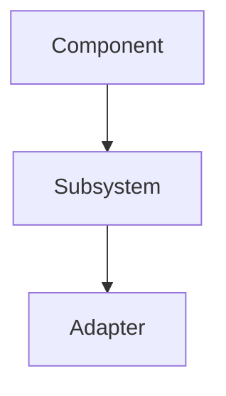

# README Writer

Write READMEs that build understanding, not READMEs that duplicate what TypeScript already tells you.

## Core Philosophy

**Document what you'd have to dig deep into the code to understand.** If someone can get it from hovering over a function in VS Code, don't write it.

## Before Writing

1. **Explore the codebase thoroughly** - Read the source files, understand the architecture
2. **Identify the non-obvious** - What would confuse someone new? What took you time to grasp?
3. **Find the "why"** - Design decisions, tradeoffs, the reasoning behind patterns

## What to Include

### Architecture and Mental Models
- How components relate to each other (use Mermaid diagrams)
- State machines and lifecycles (if they exist)
- Data flow and control flow

### Design Decisions
- WHY things are designed the way they are
- Tradeoffs that were made
- Non-obvious behaviors and their reasoning

### Key Concepts
- Domain-specific terminology
- Abstractions that aren't self-evident from the code
- Integration points with other systems

## What to NEVER Include

- API reference (function signatures, parameter types)
- Lists of exported functions/classes
- Basic usage examples that are obvious from types
- Anything someone would get from TypeScript IntelliSense

## Writing Style

- **Scannable**: Clear headers, short paragraphs, visual hierarchy
- **Concise**: Every word must earn its place
- **Direct**: No fluff, no filler, no "In this section we will..."

## Mermaid Diagrams

Use them for:
- Architecture overviews (component relationships)
- State machines (lifecycle states and transitions)
- Sequence diagrams (message flows, sync protocols)
- Flowcharts (decision logic)



## Structure Template

Not rigid, but a starting point:

```markdown
# Package Name

One to three sentences: what is this and why does it exist.

## Architecture
[Mermaid diagram showing component relationships]
Brief explanation of how pieces fit together.

## [Core Concept 1]
[State machine diagram if applicable]
Explain the concept and WHY it's designed this way.

## [Core Concept 2]
...

## Key Design Decisions
- **Decision**: Why this choice was made
- **Decision**: Why this choice was made

## Related Packages (if applicable)
Links to related packages in the ecosystem.
```

## Code Examples

Include ONLY when they clarify something non-obvious. A 3-line example showing a pattern is fine. A 20-line "getting started" that duplicates what types show is not.

## Questions to Ask Yourself

Before finalizing, ask:
- "Would a developer need to read the code to understand this without the README?"
- "Does this duplicate what TypeScript types already communicate?"
- "Is every section earning its place in the reader's attention?"
